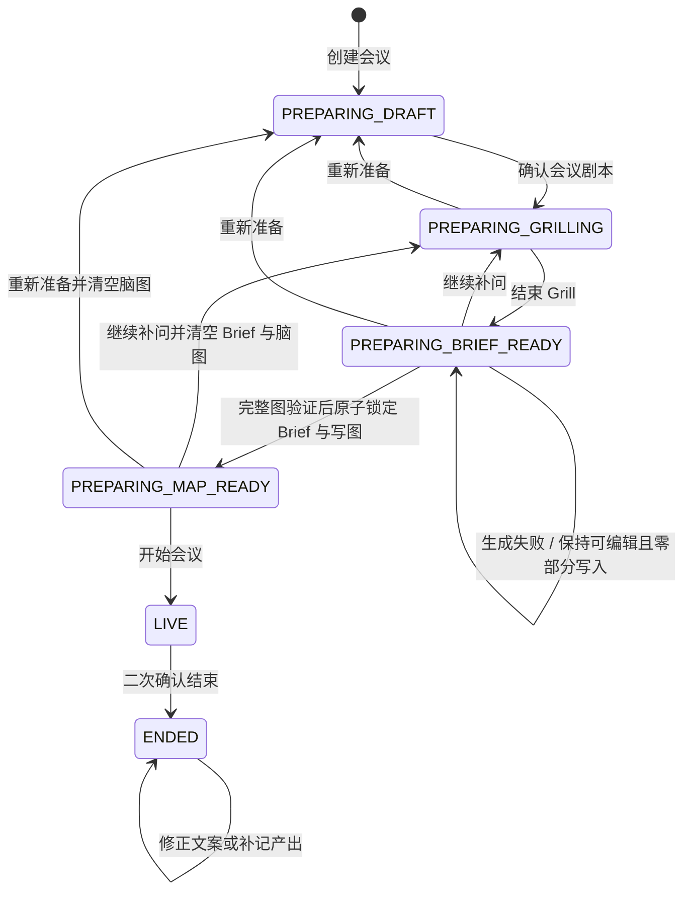
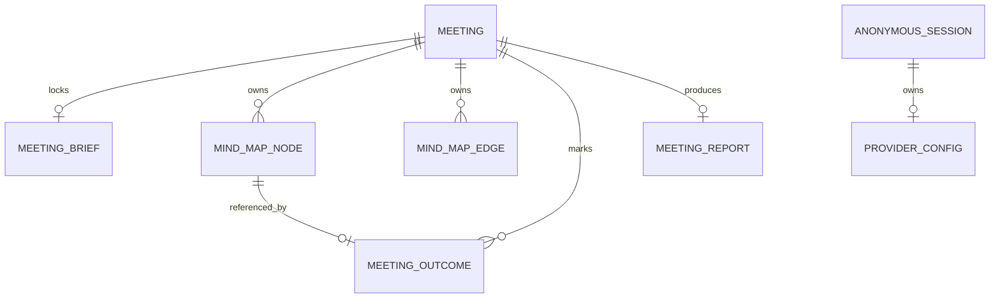

# Convergene 领域模型（v0.1）

> 本文定义代码、数据库、AI schema、UI 文案之间共享的领域语言和不变量。实现时优先复用这里的枚举与规则，不在组件内部创造近义状态。

## 1. 领域边界

Convergene 管理的是单个用户在一台设备上筹备、主持和整理会议的过程。

它负责：

- 澄清会议目标；
- 组织一张受控讨论树；
- 提供用户主动触发的 AI 思考工具；
- 标记会议产出；
- 记录会议时间与估算人时；
- 生成可导出的会议报告。

它不负责组织身份、参会考勤、多人实时协作、任务执行或财务核算。

## 2. 核心术语

### Meeting（会议）

用户为了形成一个或多个明确产出而筹备、进行并结束的一次讨论。会议具有计划时间、真实生命周期、准备阶段、会议剧本和一张会议图。

### Meeting Script（会议剧本）

根据会议意图选择的引导策略。代码枚举为：

| 枚举 | 简体中文 | 说明 |
|---|---|---|
| `DECISION` | 决策对齐 | 比较选择、明确标准、暴露风险并形成决策 |
| `BRAINSTORM` | 脑暴共创 | 发散方向、改变视角、聚类并筛选候选创意 |
| `RETRO` | 复盘改进 | 对照事实与预期、寻找原因、提炼洞察并形成行动 |
| `GENERAL` | 通用讨论 | 无法归入前三类时的低调兜底，不作为主要演示剧本 |

剧本决定 Grill 覆盖维度、初始图软模板、节点 AI 操作、默认产出类型和报告专属章节。它不改变会议生命周期和图的基本数据结构。

### Meeting Lifecycle（会议生命周期）

由用户操作确认的真实阶段：`PREPARING`、`LIVE`、`ENDED`。计划时间经过不会自动改变生命周期。

### Preparation Stage（准备阶段）

只在 `PREPARING` 生命周期内使用：

| 枚举 | 含义 |
|---|---|
| `DRAFT` | 只有原始需求，尚未确认 AI 推荐的剧本 |
| `GRILLING` | 已锁定剧本，正在逐轮澄清 |
| `BRIEF_READY` | Grill 已结束；Brief 可编辑，或兼容读取旧版本留下的已确认快照 |
| `MAP_READY` | Brief 已锁定，初始会议图已成功生成 |

### Timing State（时间状态）

由计划时间、实际开始和实际结束推导出的界面提示，不写回持久状态：会前筹备、待开始、进行中、已超时、准时结束或超时结束。

### Grill（会前拷问）

通过一次一个问题暴露目标、期望产出、参与角色、信息依赖和限制的过程。它按剧本增加专属准备维度。
当前问题本身也是本地持久状态：模型返回后先以 `PENDING` 保存问题、提问阶段、已知状态和准备度，
再由用户把同一轮更新为 `ANSWERED`、`UNKNOWN` 或 `SKIPPED`。一场会议最多有一个且只能在末尾有
`PENDING` 轮次，因此刷新可以恢复同一个问题，而不会重新调用模型或丢失准备度。
问题快照还包含 `questionType`：适合枚举回答时使用 `SINGLE_CHOICE` 并保存 2–6 个带稳定值和显示标签的选项；需要解释时使用 `FREE_TEXT`。单选题可以由用户切换到自由作答，最终仍写入同一个 `answer` 字段。

### Readiness（开会准备度）

对各准备维度是否足够清晰的结构化判断，不是概率或数学评分：

- `INSUFFICIENT`：目标或必要产出尚不能成立；
- `BARELY_READY`：可以开始，但关键未知可能影响结果；
- `READY`：核心信息已清晰，剩余问题适合带到会上解决。

UI 可以使用分段进度条呈现已覆盖维度，但不能渲染成虚假的百分制成绩。

### Meeting Brief（会议简报）

Grill 的结构化结果，区分已经确认的信息、暂时采用的假设和尚未解决的问题。点击“确认并生成脑图”时，应用先在内存中创建不可变候选快照；只有完整初始图通过校验后，Brief 才与 Node/Edge 在同一 IndexedDB 事务中写入并带上 `confirmedAt`。生成、校验或传输失败不会产生 `confirmedAt` 或部分图写入，Brief 仍可编辑后重试。

### Meeting Graph（会议图）

由节点和显式关系组成的会议内容事实源。它不包含会议生命周期、浏览器选中状态或 UI locale。

### Discussion Tree（讨论树）

会议图在 P0 的受控形态：一个根节点、每个非根节点只有一个父节点、只存在 `CONTAINS` 边并且无环。一级议题的顺序形成默认会议流程。

### Active Topic（当前议题）

会中正在主持的一级议题。它与临时选中的节点分离；节点选择用于查看、编辑和 AI 展开，不自动改变当前议题。

### Strategy Action（节点出招）

用户在选中节点后主动触发的模式化 AI 展开。卡牌只是 UI 表达；领域中它是稳定的 `strategyId`，没有牌组、能量、稀有度或胜负。

### Quick Note（随手记）

用户在会中快速输入的内容。提交后立即作为用户节点挂在当前议题下，不等待 AI。AI 可以异步建议新的父节点，但只有用户确认后才能移动。

### Meeting Outcome（会议产出）

用户明确认可为本场会议正式结果的节点引用。模型不能自行标记。产出种类为：

| 枚举 | 含义 |
|---|---|
| `DECISION` | 已经拍板或明确同意的选择 |
| `CANDIDATE_IDEA` | 值得保留、验证或继续推进的创意 |
| `INSIGHT` | 已确认的规律、原因或经验 |
| `ACTION` | 明确要推进的下一步，可选负责人和截止时间 |

同一节点最多对应一个有效产出标记。产出类型与节点内容类型分离，标记产出不应破坏节点原来的语义。

### Formation Cost Estimate（产出形成成本估算）

从上一个会中产出标记到当前产出标记期间，全体参会者累计投入的人时。它不是财务成本，也不表示严格因果归因。

### Post-meeting Addition（会后补记）

会议结束后新增的产出。它保留在报告中，但不参与形成成本估算，因为系统没有可信的会中标记时间。

### Parking Lot（停车场）

会议中发现、但不在本次范围内继续处理的节点。它属于会议图，不属于会议产出。

### UI Locale（界面语言）

全局显示偏好，控制系统按钮、状态、错误以及日期和数字格式。切换界面语言不改变会议内容。

### Content Locale（会议内容语言）

单场会议的默认 AI 输出语言，控制 Grill、Brief、初始节点和定向展开，并作为报告输出语言的默认值。单次报告可以选择其他语言而不修改它。

### Anonymous Device Session（匿名设备会话）

服务端用于关联一个浏览器与其模型配置的随机、不含业务语义的标识。标识通过 HttpOnly Cookie 保存；它不是用户账号，不能实现跨设备恢复。

### Provider Configuration（供应商配置）

一个匿名设备会话拥有一个 Provider Configuration 容器。容器分别保存 StepFun 与硅基流动的加密
凭证槽，并以独立的 `activeProvider` 指明下一次 AI 操作使用哪家供应商。供应商槽的可用/需重配
状态彼此独立；保存、轮换或认证失败只能影响对应槽。切换供应商必须由用户显式触发，失败不能
导致自动跨供应商发送会议内容。

凭证槽是否健康不等于 Provider 是否能承载某类产品任务。运行时还必须按模型角色检查独立的
Provider Capability：

| Provider | `fast` | `grill` | `report` |
|---|---|---|---|
| `SILICONFLOW` | `AVAILABLE` | `AVAILABLE` | `UNAVAILABLE` |
| `STEPFUN` | `UNAVAILABLE` | `AVAILABLE` | `UNAVAILABLE` |

`fast` 承载剧本分类和节点展开，`grill` 承载 Grill 与初始图，`report` 承载报告润色。
`UNAVAILABLE` 表示当前产品协议、可靠性或延迟门禁尚未通过，不表示 Key 错误，也不能把凭证标为
需要重配。

既有 StepFun 凭证必须继续保留，不能因能力收窄而删除或迁移掉；它属于部分可用、只读的历史
配置。只有升级前已经以 StepFun 为当前供应商的会话可以继续执行 `grill` 角色，新的测试、保存和
激活入口均不再开放 StepFun。`fast` 或 `report` 请求命中不支持的组合时必须在读取明文凭证、续期
或调用上游前拒绝。即使同一会话还保存了可用的硅基流动凭证，也不能静默切换；用户必须显式把
硅基流动设为当前供应商。

## 3. 状态机



不允许的转移：

- 时间到达不能自动执行任何生命周期转移；
- `ENDED` 不能回到 `LIVE`；
- `LIVE` 不能重新 Grill 或整图重生成；
- 只有 `MAP_READY` 可以开始会议；
- 同一浏览器的数据域内最多只有一个 `LIVE` Meeting。

准备回退规则：

- “继续补问”保留原始需求、已锁定剧本和既有 Grill 问答，清空 Brief 快照与脑图后回到 `GRILLING`；
- “重新准备”只保留原始需求，清空剧本选择、Grill、Brief 与脑图后回到 `DRAFT`；
- 已确认 Brief 的初始图生成失败时不发生阶段转移，也不能普通编辑；用户只能重试、继续补问或重新准备。

## 4. 时间状态推导

| 生命周期与时间条件 | 显示状态 |
|---|---|
| `PREPARING` 且当前时间早于计划开始 | 会前筹备 |
| `PREPARING` 且当前时间不早于计划开始 | 待开始 |
| `LIVE` 且当前时间不晚于计划结束 | 进行中 |
| `LIVE` 且当前时间晚于计划结束 | 进行中 · 已超时 |
| `ENDED` 且实际结束不晚于计划结束 | 已结束 · 准时 |
| `ENDED` 且实际结束晚于计划结束 | 已结束 · 超时 |

用户再次打开应用时，如果会议在计划结束后仍为 `LIVE`，P0 显示不可忽略的超时 banner；实现 ST-04 后才进入遗忘恢复向导。两种情况下系统都不能自动选择结束时间。

## 5. 会议图不变量

P0 每次写入后必须验证：

1. 恰好一个根节点，类型为 `OBJECTIVE`；
2. 每个非根节点恰好有一条入向 `CONTAINS` 边；
3. 不存在环和孤立节点；
4. 一级 `TOPIC` 节点具有唯一、连续的显示顺序；
5. 初始图深度不超过 2，节点总数不超过 12，一级议题为 3–5 个；
6. 标题不超过 48 个 Unicode 字素；模型目标为中文不超过 20 字、英文不超过 8 个单词；
7. 单次 AI 展开只增加 2–4 个节点；
8. AI 不能删除、移动、重命名或标记已有节点；
9. AI 归类建议不能自动改边，必须等待用户确认；
10. 每个一级 `TOPIC` 都保存一条短启动问题和一条短转场提示；
11. UI 坐标不参与领域语义，重新布局不能改变父子关系和议题顺序。

## 6. 人时与产出成本

### 总人时

```text
总人时 = (有效计算结束时间 - 实际开始时间) × 实际参会人数
```

`LIVE` 时有效计算结束时间取当前时间 `now`，用于展示累计人时；`ENDED` 后固定取 `endedAt`。P0 使用单一实际参会人数。开始时确认，结束前可以修正；修正后统一重算，不记录人员中途进出。

### 会中产出形成成本

先筛选 `origin = LIVE` 的产出，按 `markedAt` 升序排列：

```text
首项成本 = (首项标记时间 - 实际开始时间) × 实际参会人数
后续成本 = (本项标记时间 - 上一项标记时间) × 实际参会人数
未归属人时 = (有效计算结束时间 - 最后一项标记时间) × 实际参会人数
```

边界规则：

- 没有会中产出时，总人时全部为未归属人时；
- 会后补记不参与排序和成本；
- 取消会中产出后，对其余产出重新计算；
- `LIVE` 标记时间必须位于 `startedAt` 与当前时间之间；结束后必须位于 `startedAt` 与 `endedAt` 之间；
- 显示值可以四舍五入，领域计算保持毫秒或整数分钟精度；
- 报告必须写“估算”，不得写成精确财务成本。

## 7. 聚合与关系



存储边界：Meeting 聚合及其内容只在浏览器 IndexedDB；Anonymous Session 与 Provider Config 只在服务端 Redis。两者不能通过 meeting id 连接。

## 8. 领域事件

实现不要求事件溯源，但以下名称可用于 reducer、测试和跨标签页广播：

- `meeting.created`
- `meeting.scriptConfirmed`
- `preparation.restarted`
- `grill.answered`
- `grill.extended`
- `grill.resumed`
- `brief.confirmed`
- `map.generated`
- `meeting.started`
- `topic.focused`
- `node.expanded`
- `note.captured`
- `note.reparented`
- `outcome.marked`
- `outcome.unmarked`
- `meeting.ended`
- `meeting.endTimeCorrected`
- `report.generated`
- `meeting.exported`

## 9. 核心不变量摘要

- 用户操作是会议状态、当前议题、节点移动和会议产出的唯一事实来源。
- 模型生成建议，不生成事实；时间、人时、父子关系和 Mermaid 均由确定性代码处理。
- 一个设备同时只主持一场会议。
- Brief 在确认前是草稿，点击确认后立即成为不可变快照；生成失败不解锁，也不与脑图双向同步。
- 会议数据不上传服务端；配置模型不代表开启云同步。
- Provider 凭证健康与角色能力是两套状态；能力不足不污染或删除凭证，也不触发自动跨供应商
  fallback。
- 通用讨论是兜底，不削弱三种主剧本的产品表达。
