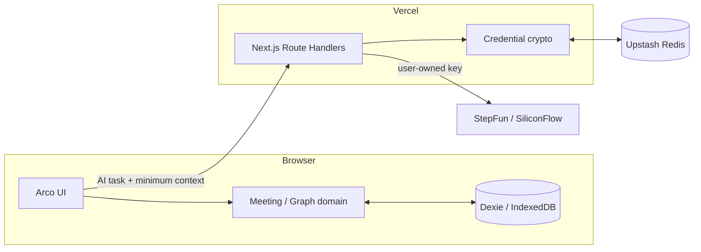

# Convergene 24 小时技术设计（v0.4）

> 状态：架构边界与工程基线已实现，P0 产品模块待实现
> 目标：一个 Next.js 工程、本地会议数据、极薄 BFF、用户自带模型 Key；确定性领域逻辑与模型推理严格分离。

## 1. 架构摘要

Convergene 是部署在 Vercel 的 Next.js 全栈应用，但不是云端会议系统：

- 会议、脑图、产出和报告只在浏览器 IndexedDB；
- Next.js Route Handlers 负责匿名模型配置、AI 代理和 schema 校验；
- Upstash Redis 只保存匿名设备的加密 Provider 配置，不保存会议内容；
- 模型 Key 由每位用户提供，系统不配置公共模型 Key；
- 模型输出必须通过 Zod 和领域校验，时间、成本、图关系和 Mermaid 均由程序确定性处理。



## 2. 推荐选型

| 层 | 选择 | 说明 |
|---|---|---|
| 运行时 | Node.js 24.x + pnpm 10 | 对齐 Vercel 新项目默认 LTS 与当前 AI SDK/commitlint |
| 应用框架 | Next.js App Router + TypeScript | 页面、BFF、部署在一个工程内 |
| UI | Arco Design React + CSS Modules | 高密度工作台，保持单一组件系统 |
| 国际化 | next-intl | locale 路由、ICU messages、日期/数字/复数 |
| 会议图 | `@xyflow/react`（React Flow） | 节点、边、选择、拖动、视口和自定义节点 |
| 自动布局 | `@dagrejs/dagre` | 从左到右的稳定树布局；不承担领域关系 |
| 浏览器数据 | Dexie + IndexedDB | 多会议、事务、版本迁移、跨刷新持久化 |
| 服务端配置 | Upstash Redis | 匿名会话、加密 Provider 配置、TTL、简单限流 |
| AI | Vercel AI SDK + `@ai-sdk/openai-compatible` + Zod | 两个赞助商共用调用实现，任务 schema 强校验 |
| 报告 | react-markdown + remark-gfm + Mermaid | 同时保留 Markdown 源码和安全预览 |
| 单元/组件 | Vitest + React Testing Library | 领域函数、schema、组件状态 |
| E2E | Playwright | 三条主流程冒烟和 locale 路由 |
| 代码质量 | ESLint 10 + Next.js Core Web Vitals + Prettier | 使用当前官方 flat config，不绑定 Airbnb preset |
| 部署 | Vercel Hobby | 黑客松个人演示免费，支持 Route Handlers |

官方实现依据：

- [Next.js Backend for Frontend](https://nextjs.org/docs/app/guides/backend-for-frontend)
- [next-intl App Router](https://next-intl.dev/docs/getting-started/app-router)
- [AI SDK structured output](https://ai-sdk.dev/docs/ai-sdk-core/generating-structured-data)
- [AI SDK OpenAI-compatible provider](https://ai-sdk.dev/providers/openai-compatible-providers)
- [React Flow concepts](https://reactflow.dev/learn/concepts/terms-and-definitions)
- [Dexie React tutorial](https://dexie.org/docs/Tutorial/React)
- [Vercel Marketplace storage](https://vercel.com/docs/marketplace-storage)
- [Upstash Redis pricing](https://upstash.com/pricing/redis)
- [Mermaid security configuration](https://mermaid.js.org/config/schema-docs/config-properties-securitylevel.html)

不引入完整 Arco Pro 模板、Redux、WebSocket、队列、独立后端仓库或通用 agent 工作流框架。

### 2.1 已实现的工程基线

- 根目录使用 `.nvmrc` 锁定 Node 24.x，`packageManager` 与 lockfile 锁定 pnpm 10；
- `src/app/[locale]` 已生成三种 locale 的静态页面，`src/proxy.ts` 承担 next-intl 语言检测；
- `src/ui/app-providers.tsx` 统一接入 Arco 的简中、繁中与英文 locale；
- `src/modules/meeting-domain` 与 `src/modules/shared` 展示深模块公共入口和 Result 类型约定；
- `eslint.config.mjs` 使用 ESLint 10、TypeScript ESLint、Next.js Core Web Vitals 与 React Hooks 官方规则；
- Husky `pre-commit` 执行 staged lint/format、typecheck、unit test，`commit-msg` 执行 Commitlint；
- Vitest 默认使用 Node 环境；未来 RTL 组件测试按文件声明 jsdom，避免纯领域测试承担浏览器环境成本；
- Playwright 基础路由测试使用 3100 端口；
- GitHub Actions 暂不启用，所有质量门禁先在本地运行。

这些内容只是可运行骨架，不表示 Dexie、Provider 配置、AI routes、会议画布或报告流程已经实现。

## 3. 存储边界

### 3.1 浏览器 IndexedDB

允许保存：

- Meeting 及其生命周期和准备阶段；
- Grill 轮次和 Brief；
- 节点、边、布局位置和当前议题；
- 会议产出、时间戳和行动项可选字段；
- 生成的报告；
- 导览完成状态等非敏感偏好；UI locale 的路由事实源是当前 URL，`NEXT_LOCALE` Cookie 只保存下次访问偏好，不重复写入 IndexedDB。

禁止保存：

- Provider API Key；
- Redis 连接信息和应用加密密钥；
- 任何其他用户的数据。

### 3.2 服务端 Redis

只允许保存：

- 匿名 session id 的哈希索引；
- Provider 枚举；
- 加密后的 API Key；
- 可选模型 ID 覆盖；
- 配置版本、创建时间、最后使用时间；
- 30 天滑动 TTL；
- 最小限流计数。

禁止保存：

- Meeting id、标题、Brief、节点、产出或报告；
- 原始模型请求和响应；
- 明文 API Key。

### 3.3 网络边界

只有用户明确触发以下动作时，浏览器才发送必要会议上下文：剧本分类、Grill、初始图、节点出招、随手记归类和报告润色。普通编辑、计时、成本计算、布局、导出和 Mermaid 生成均在本地完成。

## 4. 领域数据结构

领域语义以 [领域模型](./domain-model.md) 为准。以下接口作为实现起点，而不是可以自由改名的示意代码。

```ts
type SupportedLocale = 'zh-CN' | 'zh-TW' | 'en-US'
type MeetingMode = 'DECISION' | 'BRAINSTORM' | 'RETRO' | 'GENERAL'
type MeetingStatus = 'PREPARING' | 'LIVE' | 'ENDED'
type PreparationStage = 'DRAFT' | 'GRILLING' | 'BRIEF_READY' | 'MAP_READY'
type ReadinessLevel = 'INSUFFICIENT' | 'BARELY_READY' | 'READY'

interface Meeting {
  id: string
  title: string
  rawRequest: string
  mode?: MeetingMode
  modeReason?: string
  status: MeetingStatus
  preparationStage: PreparationStage
  contentLocale: SupportedLocale
  scheduledStartAt: string
  scheduledEndAt: string
  expectedAttendeeCount: number
  actualAttendeeCount?: number
  startedAt?: string
  endedAt?: string
  activeTopicNodeId?: string
  brief?: MeetingBriefDraft | MeetingBriefSnapshot
  report?: MeetingReport
  createdAt: string
  updatedAt: string
}

interface ReadinessDimension {
  key: string
  status: 'MISSING' | 'PARTIAL' | 'READY'
  summary?: string
}

interface MeetingBriefContent {
  objective: string
  desiredOutcome: string
  confirmed: string[]
  assumptions: string[]
  unknowns: string[]
  readiness: {
    level: ReadinessLevel
    dimensions: ReadinessDimension[]
  }
  facilitation: {
    openingLine: string
    closingChecklist: string[]
  }
}

interface MeetingBriefDraft extends MeetingBriefContent {
  confirmedAt?: never
}

interface MeetingBriefSnapshot extends MeetingBriefContent {
  confirmedAt: string
}

interface GrillTurn {
  id: string
  meetingId: string
  index: number
  phase: 'DEFAULT' | 'CRITICAL_EXTRA' | 'USER_EXTENDED'
  question: string
  reason?: string
  criticalExtraReason?: string
  disposition: 'PENDING' | 'ANSWERED' | 'UNKNOWN' | 'SKIPPED'
  answer?: string
  knownState: { confirmed: string[]; assumptions: string[]; unknowns: string[] }
  readiness: MeetingBriefContent['readiness']
  createdAt: string
}

type NodeKind =
  | 'OBJECTIVE'
  | 'TOPIC'
  | 'OPTION'
  | 'IDEA'
  | 'RISK'
  | 'INSIGHT'
  | 'ACTION'
  | 'NOTE'
  | 'PARKING'

interface ParentSuggestion {
  recommendedParentNodeId: string
  alternativeParentNodeIds: string[]
  rationale: string
  createdAt: string
}

interface MindMapNode {
  id: string
  meetingId: string
  kind: NodeKind
  title: string
  note?: string
  position: { x: number; y: number }
  source: 'USER' | 'INITIAL_AI' | 'EXPANSION_AI' | 'QUICK_NOTE'
  strategyId?: StrategyId
  topicPrompt?: string
  transitionHint?: string
  parentSuggestion?: ParentSuggestion
  createdAt: string
  updatedAt: string
}

interface MindMapEdge {
  id: string
  meetingId: string
  sourceNodeId: string
  targetNodeId: string
  kind: 'CONTAINS'
  order?: number
}

type OutcomeKind = 'DECISION' | 'CANDIDATE_IDEA' | 'INSIGHT' | 'ACTION'

interface MeetingOutcome {
  id: string
  meetingId: string
  nodeId: string
  kind: OutcomeKind
  origin: 'LIVE' | 'POST_MEETING'
  markedAt?: string
  owner?: string
  dueDate?: string
  note?: string
}

interface MeetingReport {
  locale: SupportedLocale
  markdown: string
  generatedAt: string
  sourceUpdatedAt: string
}
```

准备阶段与 Brief 形态必须一起校验：`DRAFT` 不保存已确认的 `mode` 或 Brief；`GRILLING` 已有锁定剧本但没有 Brief；`BRIEF_READY` 可以保存草稿或已确认快照；`MAP_READY` 必须保存已确认快照和合法初始图。点击确认只把草稿替换为快照，初始图成功后才转入 `MAP_READY`。

`GrillTurn` 按 `[meetingId+index]` 连续保存且总数不超过 10；只有最后一轮可以是 `PENDING`，并且该记录只能原位更新一次处置与回答，问题、阶段、已知状态和准备度快照保持不变。

`StrategyId` 的闭集定义在 [AI 任务契约](./ai-contracts.md)。不要以用户可见的翻译文案作为持久化 id。

## 5. IndexedDB 设计

建议 Dexie v1 schema：

```ts
db.version(1).stores({
  meetings: 'id, status, preparationStage, scheduledStartAt, updatedAt',
  nodes: 'id, meetingId, [meetingId+kind], updatedAt',
  edges: 'id, meetingId, sourceNodeId, targetNodeId, [meetingId+sourceNodeId]',
  outcomes: 'id, meetingId, &[meetingId+nodeId], [meetingId+origin], markedAt',
  grillTurns: 'id, meetingId, [meetingId+index]',
  appState: 'key'
})
```

`appState` 至少保存：

- `activeMeetingId`：实现唯一 `LIVE`；
- `guideCompleted`；
- 数据导出 schema 版本。

`uiLocale` 由当前 URL 决定，`NEXT_LOCALE` Cookie 保存下次访问偏好；不在 `appState` 建立可能分叉的另一份持久化事实源。

关键写入使用 Dexie transaction：

- 开始会议：检查 `activeMeetingId`、更新 Meeting、写入单例状态；
- 结束会议：更新 Meeting、清空单例状态；
- 应用 AI 展开：验证图后同时写节点与边；
- 确认 AI 归类：删除旧边、写新边并再次验证无环；
- 标记会议产出：同一事务内保证每个 Meeting 的同一 Node 最多一条 Outcome；取消标记时删除该记录；
- 删除 Meeting：级联删除节点、边、产出和 Grill turns。

跨标签页使用 `BroadcastChannel` 或 Dexie live query 刷新状态；正确性依赖 IndexedDB 事务，不依赖广播消息先后。

## 6. 匿名会话与模型配置

### 6.1 会话

- Cookie 名称：`convergene_session`；
- 值：至少 256 bit 的加密随机 id；
- 属性：`HttpOnly; Secure; SameSite=Strict; Path=/`；
- 重复同名 Cookie 直接拒绝；只有 Cookie 对应的 Redis record 存在时才能复用 session，否则保存时由服务端重新生成随机 id；
- 服务端只在用户保存模型配置时创建；浏览导览不创建会话；
- Redis key 使用 `provider-config:${sha256(sessionId)}`，不直接使用 Cookie 值；
- 每次成功读取配置后原子更新 Redis `lastUsedAt` 与 30 天 TTL，并同步续期 Cookie；状态读取只校验加密 envelope 结构，不能为展示状态而解密 Key。

### 6.2 加密记录

使用 Node `crypto` 的 AES-256-GCM：

```ts
interface EncryptedProviderConfig {
  version: 1
  provider: 'STEPFUN' | 'SILICONFLOW'
  ciphertext: string
  iv: string
  authTag: string
  modelOverrides?: {
    grill?: string
    fast?: string
    report?: string
  }
  createdAt: string
  lastUsedAt: string
}
```

- `APP_ENCRYPTION_SECRET` 必须是独立的 32-byte base64 secret；
- runtime 初始化时必须先校验它是 canonical base64 且恰好解码为 32 bytes；格式错误统一视为配置存储不可用；
- 每次写入使用新的 96-bit IV；
- Provider 和模型 id 可以明文保存，API Key 必须在 `ciphertext` 中；
- 解密只发生在调用模型前的服务端内存；
- 不返回、记录或重新显示原始 Key；
- 解密失败视为配置失效，要求用户重新输入，不自动尝试其他 key。

### 6.3 Provider 白名单

```ts
const providerPresets = {
  STEPFUN: {
    baseURL: 'https://api.stepfun.com/step_plan/v1',
    defaultModels: { grill: 'step-3.7-flash', fast: 'step-3.7-flash', report: 'step-3.7-flash' }
  },
  SILICONFLOW: {
    baseURL: 'https://api.siliconflow.cn/v1',
    defaultModels: {
      grill: 'deepseek-ai/DeepSeek-V4-Flash',
      fast: 'deepseek-ai/DeepSeek-V4-Flash',
      report: 'deepseek-ai/DeepSeek-V4-Flash'
    }
  }
} as const
```

2026-08-29 的真实 sponsor probe 已验证 StepFun 的 `step-3.7-flash` 与硅基流动的 `deepseek-ai/DeepSeek-V4-Flash`：二者均通过 streaming、JSON Schema、1ms 取消与无效模型错误归一化，因此批准为 P0 preset。共享 OpenAI-compatible adapter 必须显式声明 `supportsStructuredOutputs: true`，否则当前 AI SDK 只发送旧 `json_object` 模式而不发送 JSON schema；StepFun 还会把 reasoning token 计入输出上限，最小 probe 使用 512 token 才稳定。产品任务的 adapter 默认使用 2,048 token 的有界预算，调用方可以按 schema 覆盖，但不能低于 512，避免稍复杂的分类在发出 JSON 前耗尽 reasoning budget。probe 使用 bounded `streamText`，覆盖默认 `onError` 以禁止原始 Provider 错误日志，并只返回脱敏分类和 elapsed time。完整证据见 [高风险集成验证记录](./integration-validation.md)。ST-01 高级设置只覆盖 model id：最大 128 字符，只允许常见模型 id 字符集；不接受 URL、header 或任意 JSON 参数。基础 P0 只使用 preset。

## 7. Route Handlers

### 模型配置

```text
GET    /api/provider-config/status
POST   /api/provider-config/test
PUT    /api/provider-config
DELETE /api/provider-config
```

- `test` 使用用户提交的 Key 做一次最小调用，不提前持久化；
- `status` 只做加密 envelope 的结构校验，并返回是否已配置、Provider、固定掩码提示和模型覆盖；不解密也不返回 Key；
- `PUT` 测试成功后创建/更新匿名会话和加密记录；
- `DELETE` 幂等删除 Redis 记录并清除 Cookie。

### AI 任务

```text
POST /api/ai/classify-meeting
POST /api/ai/grill
POST /api/ai/initial-map
POST /api/ai/expand-node
POST /api/ai/classify-note
POST /api/ai/report
```

`classify-note` Route 属于 ST-02 Stretch；其余 Route 是基础 P0。预先定义契约不代表 Stretch 已完成或进入 P0 门禁。

共享处理链：

```text
验证 Origin / Content-Type / body 大小
→ 读取匿名会话
→ Redis 获取并解密 Provider 配置
→ Zod 验证 task input
→ 按任务选择 model
→ 调用 OpenAI-compatible provider
→ Zod 验证 output
→ 领域级约束验证
→ 返回 typed result
```

接口不接收 meeting id 作为服务端数据索引；meeting id 仅可作为客户端相关 id 原样返回，服务端不能据此读取任何业务数据。

## 8. 模块接缝

### `meeting-domain`

```ts
deriveMeetingView(meeting, now): MeetingView
startMeeting(state, meetingId, attendeeCount, now): StartResult
endMeeting(state, meetingId, attendeeCount, now): EndResult
recoverForgottenMeeting(meeting, choice): Meeting
calculateMeetingEconomics(meeting, outcomes, now): MeetingEconomics
```

`recoverForgottenMeeting` 是 ST-04 Stretch 接缝；基础 P0 只推导超时状态并展示 banner，不调用恢复决策。

纯函数负责状态和成本；`now` 必须由调用方显式传入，以便 `LIVE` 累计人时可测试且不读取隐式系统时钟。组件、模型和报告不能重复实现。

### `mind-map-domain`

```ts
validateInitialMap(graph): ValidationResult
validateTree(graph): ValidationResult
applyExpansion(graph, expansion): Graph
reparentNode(graph, nodeId, parentId): Graph
orderedTopicIds(graph): string[]
subtreeNodeIds(graph, rootId): string[]
```

所有修改先在内存应用并验证，通过后再事务写入。

### `meeting-ai`

```ts
runMeetingAI<TTask extends MeetingAITask>(
  task: TTask,
  input: TaskInput<TTask>,
  provider: ResolvedProviderConfig
): Promise<TaskOutput<TTask>>
```

Provider、模型路由、prompt、schema 和错误映射集中在该模块；Route Handler 不拼 prompt。

### `report-domain`

```ts
buildFactDraft(meeting, graph, outcomes): ReportFacts
buildMermaidCharts(facts, mode, locale): MermaidChart[]
renderFallbackTables(facts, locale): MarkdownSection[]
```

模型只接受 `ReportFacts`，不能接受“自由总结整张图”的无约束请求。

### `provider-config`

封装 session、Redis、AES-GCM、Provider 白名单和模型解析。业务模块只拿到一次请求内有效的 `ResolvedProviderConfig`，不能接触 Redis record。

生产实现位于 `src/modules/provider-config/`：Cookie 使用 32-byte base64url 随机 id，Redis key
只含其 SHA-256；Key 由 AES-256-GCM envelope 保存，状态接口只返回固定掩码。PUT 在每次写入前
重新执行最小结构化 Provider 调用，失败不覆盖旧 record；成功读取会原子更新 `lastUsedAt` 和
Redis 的 30 天 TTL，并续期 Cookie。只有真正调用模型的 `resolve` 路径会在服务端内存解密 Key，
状态读取不会解密。限流只在 Cookie 对应的 Redis record 存在时切换到 session bucket，否则继续
使用 IP bucket；Redis/Lua 故障返回配置不可用，不能伪装为用户触发限流。
`src/modules/meeting-ai/provider-adapter.ts` 是 Provider endpoint、model role、JSON
Schema、超时/取消及错误归一化的唯一共享边界。

## 9. 画布与布局

- Dagre rank direction 固定 `LR`；
- 根节点和一级议题顺序稳定，不因新增节点随机重排；
- 用户拖动后保存位置；只有点击“整理布局”才重跑全图布局；
- 切换 Active Topic 时计算其子树节点集合并调用 React Flow `fitView`；
- 自动聚焦只发生于用户切换议题或点击“重新聚焦”，AI 返回时不抢镜头；
- 非当前分支通过样式降权，不从 DOM 或图数据删除；
- `prefers-reduced-motion` 下禁用平滑动画；
- 删除父节点必须明确选择级联删除子树或先移动子节点，P0 推荐只提供级联删除并二次确认。

## 10. AI 性能与失败策略

- `classify-meeting`、`expand-node` 使用 fast 模型；实现 ST-02 时，`classify-note` 也使用 fast 模型；
- `grill` 使用质量优先模型；
- `initial-map` 和 `report` 使用结构化输出稳定的模型；
- 若三个 role 指向同一模型，接口保持不变；
- 初始图 schema 失败后最多进行一次修复请求；
- 其他任务不自动多次消耗用户额度，错误后由用户重试；
- 节点展开和随手记归类不发送完整历史，只发送契约允许的最小上下文；
- 报告模型失败时返回本地事实草稿，不把整个报告判为失败；
- 客户端为每次请求生成 request id，重复响应不得应用两次；
- 用户切换会议或撤销时，前端可以取消请求并忽略迟到响应。

详细 schema 见 [AI 任务契约](./ai-contracts.md)。

## 11. Markdown 与 Mermaid

- 使用 `react-markdown` 和 `remark-gfm`；不启用原始 HTML；
- Mermaid `securityLevel: 'strict'`；
- 所有用户节点标题先转义，限制每图节点、边和文本长度；
- 最多三张图，按剧本选择，不机械填满；
- 数据不足时不生成占位图；
- 解析或渲染失败时显示相同数据的 Markdown 表格和 Mermaid 源码；
- 模型不直接生成 Mermaid fenced block；
- 导出 `.md` 使用报告 locale 的标题和标签，并包含时区。

建议图表：

| 剧本 | 优先图 |
|---|---|
| 决策对齐 | 决策脉络 flowchart、产出时间线、人时分配 |
| 脑暴共创 | 创意分组 flowchart、候选形成时间线、人时分配 |
| 复盘改进 | 原因到行动 flowchart、事件/产出时间线、人时分配 |
| 通用讨论 | 会议脉络、产出时间线、人时分配 |

## 12. 国际化接入

- 页面位于 `src/app/[locale]/`，locale 前缀始终存在；
- API route 不带 locale，所有 AI 请求显式包含 `outputLocale`；
- `<html lang>`、next-intl message、Arco locale 使用同一 `uiLocale`；
- Meeting 的 `contentLocale` 是业务数据，不随 URL 切换；
- 结构化枚举永远使用英文稳定 id，不持久化翻译结果作为状态；
- 详细规则见 [国际化规范](./i18n.md)。

## 13. 安全与隐私

### 请求安全

- 只接受 `POST/PUT/DELETE` 的同源 `Origin`；
- Cookie 使用 `SameSite=Strict`，修改配置接口仍校验 Origin；
- Route Handler 限制 JSON body 大小、字段长度和数组数量；
- Provider Base URL 必须来自编译期白名单，防止 SSRF；
- 模型 id 只作为白名单 Provider 的路径参数值，不允许换行、URL 或 header 注入；
- Redis 连接和 `APP_ENCRYPTION_SECRET` 只在服务端环境变量；
- 生产日志不记录 Key、Cookie、Prompt、Brief、节点或模型完整响应；
- CSP 为每个页面请求生成 nonce，生产 `script-src` 使用 `strict-dynamic` 且禁止 `unsafe-inline`，`connect-src` 只允许同源；因此页面和全局 404 采用动态渲染；matcher 只排除 API、Next/Vercel 内部路径和明确的 metadata 资源，不按“路径含点”跳过未知 HTML；
- API Key 表单关闭浏览器自动完成，并标记为不应由常见密码管理器捕获；
- Markdown 不渲染原始 HTML，Mermaid 使用 strict。

### 数据说明

设置页必须明确：

- 模型配置加密保存于服务端，并在 30 天不活跃后删除；
- 触发 AI 时，必要会议内容会发送给用户选择的模型供应商；
- 会议内容不会保存到 Convergene 后端；
- 清除模型配置和清除本地会议数据是两个独立操作。

### 免费层保护

- Redis 按匿名 session 做基础限流，例如 AI route 每分钟 30 次；
- 配置接口在 session 创建前按代理提供的客户端地址做单向 SHA-256 scope，创建后按 session 做
  scope；原始地址和 Cookie 都不进入 Redis key 或日志。计数与首次过期时间由同一 Lua script
  原子设置，第 31 次请求返回稳定 `RATE_LIMITED`；
- 用户 Key 的供应商错误不能无限自动重试；
- Vercel Hobby 超额后停止服务而不是产生按量账单；
- 不配置公共模型 Key，因此公开页面不会消耗项目方模型额度。

## 14. JSON 导出

导出结构带稳定版本：

```ts
interface ConvergeneExportV1 {
  format: 'convergene-export'
  version: 1
  exportedAt: string
  meetings: Meeting[]
  nodes: MindMapNode[]
  edges: MindMapEdge[]
  outcomes: MeetingOutcome[]
  grillTurns: GrillTurn[]
}
```

- 不包含 API Key、匿名 session、Redis 数据或 UI 临时选中状态；
- 导出前从 IndexedDB 事务读取一致快照；
- 文件名包含日期，不包含会议标题等潜在敏感内容；
- P0 只导出，不实现导入；
- P1 导入必须校验 version、所有 id 引用和图不变量。

## 15. 建议目录

```text
src/
├── app/
│   ├── [locale]/
│   │   ├── layout.tsx
│   │   ├── page.tsx
│   │   ├── guide/page.tsx
│   │   └── meetings/[id]/page.tsx
│   └── api/
│       ├── provider-config/
│       └── ai/[task]/route.ts
├── features/
│   ├── dashboard/
│   ├── onboarding/
│   ├── grill/
│   ├── meeting-room/
│   ├── outcomes/
│   └── report/
├── modules/
│   ├── meeting-domain/
│   ├── mind-map-domain/
│   ├── report-domain/
│   ├── meeting-ai/
│   ├── meeting-db/
│   └── provider-config/
├── i18n/
├── ui/
└── fixtures/
messages/
├── zh-CN.json
├── zh-TW.json
└── en-US.json
```

模块按变化原因分组。`features` 负责用例编排，`modules` 负责可测试领域逻辑，`ui` 只放跨功能展示组件。

## 16. 环境变量

```text
APP_ENCRYPTION_SECRET=base64-encoded-32-byte-secret
UPSTASH_REDIS_REST_URL=...
UPSTASH_REDIS_REST_TOKEN=...
NEXT_PUBLIC_APP_URL=https://your-project.vercel.app
```

不要创建 `AI_PROVIDER_API_KEY` 或公共模型 Key。Provider Base URL 与默认模型映射保存在服务端代码配置中，不通过 `NEXT_PUBLIC_*` 暴露。

## 17. 部署与成本

- Vercel Hobby：`$0/月`，适合个人、非商业黑客松演示；
- Upstash Redis Free：`$0/月`，当前免费层足够保存小型加密配置；
- 使用 `vercel.app` 免费域名；
- 模型费用由用户自己的 sponsor Key 承担；
- 不依赖 Vercel Password Protection；应用公开访问，AI 调用仍要求用户配置 Key。

赞助商没有提供可替代 Vercel 的 Next.js 托管权益。StepFun 为主力模型预设，硅基流动为第二预设；VibeToken 和 AI Ping 可用于开发期横评，不进入 P0 产品配置。

## 18. 工程验证清单

开始主功能前完成：

- [x] 创建 Upstash Redis Free 实例，并用临时注入的服务端环境变量验证加密 set/get/续期/delete；
- [x] 验证 AES-GCM round-trip、错误密钥和被修改 ciphertext/auth tag 的失败行为；
- [x] 用 sponsor Key 验证两个 Provider 的 Base URL、模型 id、streaming、结构化输出、timeout 和错误格式；六个 live case 均通过；
- [ ] 验证 Hobby Function 最大时长覆盖最慢报告请求；
- [x] 在 test-only Vite page 用真实 Chromium 验证 12 节点长文本 DOM 尺寸/换行、Dagre LR、subtree bounds/viewport 和 React Flow instance 显式 `fitView`；
- [x] 验证 Mermaid flowchart、受控 period label 的 timeline 和 pie；时钟冒号 timeline 降级为 flowchart/table；
- [ ] 验证 IndexedDB 在目标浏览器和无痕模式的失败提示。

Spike 的测试位置、官方资料、候选 model mapping 和未解除 blocker 统一记录在 [高风险集成验证记录](./integration-validation.md)。

## 19. 相关决策

- [ADR 0001：底层保存图，P0 呈现树](./adr/0001-store-a-graph-present-a-tree.md)
- [ADR 0002：会议数据本地优先，模型凭证服务端加密保存](./adr/0002-local-data-and-server-credentials.md)
- [ADR 0003：会议剧本与通用会议产出](./adr/0003-meeting-scripts-and-outcomes.md)
